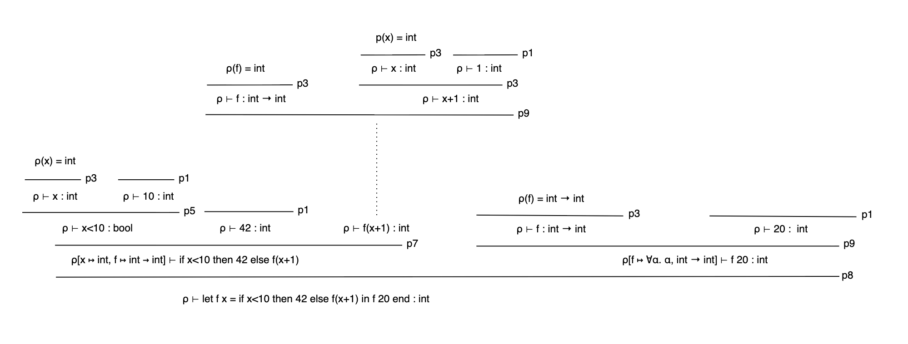

## 6.4

#### type-rule-tree 6.4.1

#### type-rule-tree 6.4.2

## 6.5
(i)

type of ``let f x = 1 in f f end`` is int

type of ``let f g = g g in f end`` fails since its calling g with g itself and g would need to be a function that takes ifself as input. Which makes a infinitely nested type.

type of ``let f x = let g y = y in g false end in f 42 end`` is bool

type of ``let f x = let g y = if true then y else x in g false end in f 42 end`` fails since the if has two branches that must have the same type and we then call g false wihch makes y=bool and x=bool which makes f 42 crash.

type of ``let f x = let g y = if true then y else x in g false end in f true end `` is bool

inferType (fromString "let f x = let g y = if true then y else x in g false end in f true end");;

(ii)

bool -> bool

``let f x = if x then false else true in f end``

int -> int

``let f x = x + 1 in f end``

int -> int -> int

``let f x = let g y = x + y in g end in f end``

'a -> 'b -> 'a

``let f x = let g y = x in g end in f end``

'a -> 'b -> 'b

``let f x = let g y = y in g end in f end``

('a -> 'b) -> ('b -> 'c) -> ('a -> 'c)

``let f g = let compose k = let h x = k (g x) in h end in compose end in f end``

'a -> 'b

``let f x = f x in f end``

'a

``let f x = f x in f 1 end``

## 7.1
we followed the readme, with the addition of adding the MicroVM folder + building that, so the Micro-c test suite returned OK for all outputs