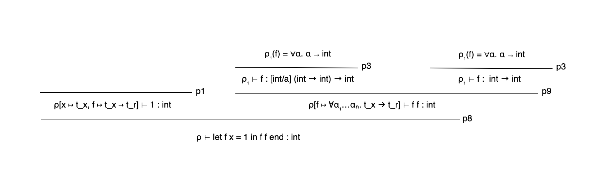

## 6.4

#### type-rule-tree 6.4.1

## 7.1
we followed the readme with the addition of adding the MicroVM folder and building that so that the Micro-c test suite 
doesnt do errors because of the missing MicroVM. 